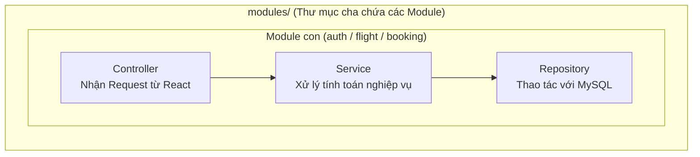
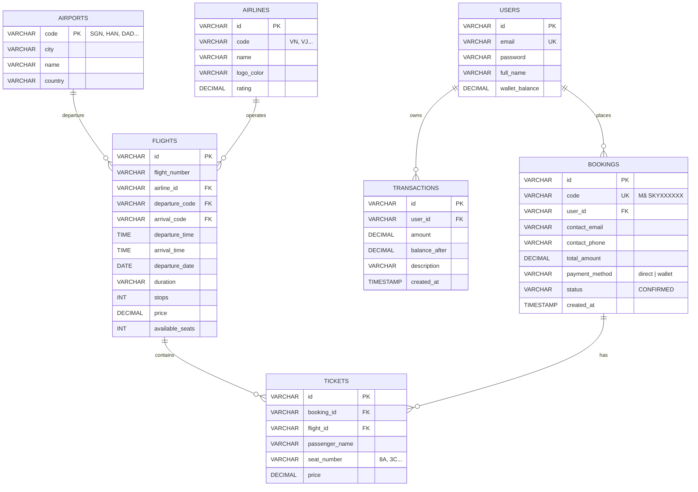

# 🚀 KẾ HOẠCH TRIỂN KHAI BACKEND SPRING BOOT + MYSQL
## (PHIÊN BẢN TINH GỌN CHẠY LOCALHOST - KISS APPROACH)

> **Mục tiêu**: Tinh gọn hóa tối đa, loại bỏ các thành phần phức tạp không cần thiết (Nginx, Redis, Cloud, Lock phân tán). Giữ vững cấu trúc 3 tầng chuẩn mực để hoàn thiện hệ thống Fullstack chạy mượt mà 100% trên Localhost chỉ trong **2 - 3 ngày**.

---

## 1. MÔ HÌNH HOẠT ĐỘNG TRÊN LOCALHOST

Toàn bộ hệ thống chạy trực tiếp trên máy tính của bạn với 3 cổng (ports) độc lập:

```mermaid
graph LR
    subgraph Localhost ["MÁY TÍNH CÁ NHÂN (LOCAL ENVIRONMENT)"]
        direction TB
        
        FE["1. FRONTEND (React + Vite)\nhttp://localhost:5173\n(Giao diện người dùng)"]
        
        BE["2. BACKEND (Spring Boot 3)\nhttp://localhost:8080\n(Xử lý API & Nghiệp vụ)"]
        
        DB[("3. DATABASE (MySQL)\nlocalhost:3306\n(Lưu trữ dữ liệu)")]
        
        FE -->|Gọi HTTP REST JSON\n@CrossOrigin| BE
        BE -->|Spring Data JPA\n(HikariCP Driver)| DB
    end
```

### Điểm khác biệt so với bản Doanh nghiệp:
* **Không dùng Nginx**: Bật `@CrossOrigin` trong Spring Boot để Frontend gọi trực tiếp Backend.
* **Không dùng Redis**: Đọc thẳng dữ liệu từ MySQL vì dữ liệu nhỏ, tốc độ phản hồi chỉ vài mili-giây.
* **Không dùng Docker phức tạp**: Chạy trực tiếp MySQL qua XAMPP hoặc MySQL Workbench, chạy Spring Boot bằng nút **Run (tam giác xanh)** trong IntelliJ IDEA / Eclipse.

---

## 2. CẤU TRÚC THƯ MỤC MODULAR MONOLITH (CHUẨN CHỈNH)

Backend được tổ chức gom toàn bộ các tính năng nghiệp vụ vào thư mục cha `modules/`, tách biệt hoàn toàn với cấu hình (`config/`) và tiện ích dùng chung (`common/`):

```
src/main/java/com/skyticket/
│
├── SkyticketApplication.java          # File chính bấm RUN để khởi chạy ứng dụng
│
├── config/                            # CẤU HÌNH DÙNG CHUNG HỆ THỐNG
│   ├── CorsConfig.java                # Mở CORS cho phép React http://localhost:5173 gọi API
│   └── SecurityConfig.java            # Cấu hình bảo mật hệ thống
│
├── common/                            # TIỆN ÍCH DÙNG CHUNG TOÀN HỆ THỐNG
│   └── ApiResponse.java               # Định dạng JSON trả về chuẩn: { success, data, message }
│
└── modules/                           # 📦 THƯ MỤC CHA GOM TẤT CẢ CÁC MODULE NGHIỆP VỤ
    │
    ├── auth/                          # 🧑‍💻 MODULE 1: BẠN 1 (Tài khoản & Xác thực)
    │   ├── AuthController.java        # API: /api/auth/login, /api/auth/register
    │   ├── AuthService.java           # Xử lý logic đăng ký, đăng nhập
    │   ├── User.java                  # Entity ánh xạ bảng `users` trong MySQL
    │   └── UserRepository.java        # Thao tác DB tìm user theo email
    │
    ├── flight/                        # 🧑‍💻 MODULE 2: BẠN 2 (Chuyến bay & Sân bay)
    │   ├── FlightController.java      # API: /api/flights/search, /api/airports
    │   ├── FlightService.java         # Xử lý logic tìm chuyến bay rẻ nhất, sớm nhất
    │   ├── Flight.java                # Entity ánh xạ bảng `flights`
    │   ├── Airport.java               # Entity ánh xạ bảng `airports`
    │   ├── Airline.java               # Entity ánh xạ bảng `airlines`
    │   └── FlightRepository.java      # Thao tác DB tìm kiếm chuyến bay
    │
    └── booking/                       # 🧑‍💻 MODULE 3: BẠN 3 (Đặt vé, Ghế ngồi & Ví tiền)
        ├── BookingController.java     # API: /api/bookings, /api/bookings/my-tickets
        ├── BookingService.java        # Xử lý logic: trừ số ghế, trừ tiền ví, sinh mã SKYXXXXXX
        ├── Booking.java               # Entity ánh xạ bảng `bookings`
        ├── Ticket.java                # Entity ánh xạ bảng `tickets`
        └── BookingRepository.java     # Thao tác DB lưu vé và tra cứu lịch sử
```

### Mỗi Module con là một khối tự vận hành đầy đủ 3 tầng:


---

## 3. CƠ SỞ DỮ LIỆU TINH GỌN (CHỈ 6 BẢNG THIẾT YẾU)

Tối giản các bảng phức tạp, chỉ giữ lại đúng những bảng phục vụ giao diện đặt vé:



---

## 4. DANH SÁCH 6 API CỐT LÕI (ĐỦ CHO TOÀN BỘ FRONTEND)

Frontend React hiện tại chỉ cần đúng 6 Endpoint này là chạy mượt mà toàn bộ chức năng:

| Endpoint | Method | Chức năng trên Giao diện React |
| :--- | :--- | :--- |
| `/api/auth/login` | `POST` | Đăng nhập trên Navbar / LoginModal, trả về thông tin user & số dư ví. |
| `/api/auth/register` | `POST` | Đăng ký tài khoản mới (tặng sẵn 15 triệu trong ví để test). |
| `/api/airports` | `GET` | Lấy danh sách sân bay đổ vào 2 ô chọn "Điểm đi" & "Điểm đến". |
| `/api/flights/search` | `GET` | Tìm kiếm chuyến bay theo `from`, `to`, `date` hiển thị trên `ListPage`. |
| `/api/flights/{id}/occupied-seats` | `GET` | Lấy danh sách ghế đã có người đặt để bôi xám trên màn hình `SeatSelection`. |
| `/api/bookings` | `POST` | Nhấn "Thanh toán" trên `BookingPage`: Trừ ví + tạo vé + sinh mã `SKYXXXXXX`. |
| `/api/bookings/my-tickets` | `GET` | Hiển thị danh sách vé đã đặt và lịch sử ví trên trang `MyTicketsPage`. |

---

## 5. PHÂN CHIA CÔNG VIỆC CHO TEAM 3 - 4 NGƯỜI (HOÀN THÀNH TRONG 2 - 3 NGÀY)

```
                            [PROJECT SCOPE]
                                   │
         ┌─────────────────────────┼─────────────────────────┐
         ▼                         ▼                         ▼
   [THÀNH VIÊN 1]            [THÀNH VIÊN 2]            [THÀNH VIÊN 3]
 Khởi tạo DB & Spring    Chuyến bay & Sơ đồ ghế      Đặt vé & Nối React
 (User, Auth, Cấu hình)   (Tìm kiếm, Lọc, Ghế)     (Tạo booking, Nối API)
```

### 🧑‍💻 Thành viên 1: Setup Dự án & Quản lý Tài khoản (User & Auth)
* Tạo database MySQL `skyticket_db` và chạy script tạo bảng.
* Khởi tạo dự án Spring Boot trên [start.spring.io](https://start.spring.io/) (chọn `Spring Web`, `Spring Data JPA`, `MySQL Driver`, `Lombok`).
* Viết cấu hình CORS cho phép `http://localhost:5173`.
* Hoàn thiện API Đăng ký & Đăng nhập (`/api/auth/**`).

### 🧑‍💻 Thành viên 2: Module Chuyến bay (Flight & Search)
* Nhập sẵn dữ liệu mẫu (16 sân bay và khoảng 20 chuyến bay) vào MySQL.
* Tạo `FlightEntity` và `FlightRepository`.
* Viết API tìm kiếm chuyến bay `/api/flights/search?from=SGN&to=HAN&date=...`.
* Viết API trả về danh sách các ghế đã bị đặt của một chuyến bay.

### 🧑‍💻 Thành viên 3: Module Đặt vé & Ví điện tử (Booking & Wallet)
* Tạo `BookingEntity` và `TicketEntity`.
* Viết hàm `createBooking()`:
  * Kiểm tra tiền ví (nếu chọn thanh toán bằng ví).
  * Trừ tiền ví và ghi nhận lịch sử giao dịch.
  * Trừ số ghế khả dụng `available_seats`.
  * Sinh mã đặt chỗ PNR dạng `SKY` + 6 ký tự ngẫu nhiên.
* Viết API lấy danh sách vé của người dùng (`/api/bookings/my-tickets`).

### 🧑‍💻 Thành viên 4 (hoặc Thành viên 1 kiêm nhiệm): Ghép nối Frontend React
* Mở file [src/context.tsx](file:///D:/Database/flight-ticket-booking1-main/src/context.tsx) trên Frontend React.
* Thay các hàm gọi dữ liệu giả bằng lệnh gọi Axios/fetch đến `http://localhost:8080/api/...`.
* Chạy thử toàn bộ luồng từ giao diện web xuống MySQL.

---

## 6. HƯỚNG DẪN 3 BƯỚC KHỞI CHẠY TẠI LOCALHOST

### Bước 1: Chuẩn bị Cơ sở dữ liệu MySQL
1. Bật **MySQL** (qua XAMPP hoặc MySQL Workbench).
2. Tạo database:
   ```sql
   CREATE DATABASE skyticket_db CHARACTER SET utf8mb4 COLLATE utf8mb4_unicode_ci;
   ```

### Bước 2: Chạy Backend Spring Boot
1. Mở thư mục backend bằng IntelliJ IDEA hoặc VS Code.
2. Kiểm tra file `src/main/resources/application.properties`:
   ```properties
   server.port=8080
   spring.datasource.url=jdbc:mysql://localhost:3306/skyticket_db?useSSL=false&serverTimezone=UTC
   spring.datasource.username=root
   spring.datasource.password=123456
   spring.jpa.hibernate.ddl-auto=update
   spring.jpa.show-sql=true
   ```
3. Bấm **Run** `SkyticketApplication.java`. Backend sẽ chạy tại: `http://localhost:8080`.

### Bước 3: Chạy Frontend React
1. Mở terminal tại thư mục `flight-ticket-booking1-main`:
   ```bash
   npm run dev
   ```
2. Mở trình duyệt truy cập: **`http://localhost:5173`**. Toàn bộ hệ thống đã kết nối hoàn chỉnh!

---

*Kế hoạch triển khai tinh gọn SkyTicket Localhost · Phiên bản 2.0*
