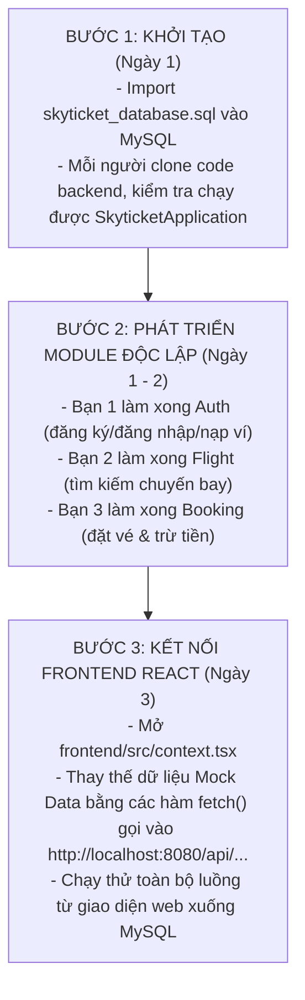

# 📋 KẾ HOẠCH PHÁT TRIỂN HỆ THỐNG SKYTICKET (LOCAL FULLSTACK)
## Mô hình: React 18 + Spring Boot 3 (Modular Monolith) + MySQL 8.0

---

## 1. TỔNG QUAN HỆ THỐNG & LUỒNG VẬN HÀNH

Hệ thống chạy hoàn toàn trên máy tính cá nhân (Localhost) gồm 3 trạm độc lập:

```mermaid
graph LR
    FE["💻 FRONTEND (React)\nhttp://localhost:5173\n(Giao diện người dùng)"]
    BE["⚙️ BACKEND (Spring Boot)\nhttp://localhost:8080\n(Xử lý logic & API)"]
    DB[("🗄️ DATABASE (MySQL)\nlocalhost:3306\n(Lưu trữ dữ liệu)")]

    FE -->|Gọi HTTP REST API\n(JSON)| BE
    BE -->|Spring Data JPA\n(HikariCP Driver)| DB
```

* **Trạng thái hiện tại**: Frontend đang hiển thị bằng **Mock Data nội bộ** để xem trước giao diện.
* **Mục tiêu tiếp theo**: 3 lập trình viên hoàn thành 3 module Backend để thay thế Mock Data bằng dữ liệu thật từ MySQL.

---

## 2. CẤU TRÚC BACKEND (MODULAR MONOLITH)

Mã nguồn Backend tại `backend/src/main/java/com/skyticket/` được phân chia rõ ràng:

```text
com/skyticket/
├── SkyticketApplication.java          # Nút RUN để khởi chạy server
│
├── config/                            # ⚙️ Cấu hình chạy ngầm hệ thống
│   └── CorsConfig.java                # Cho phép React localhost:5173 gọi API
│
├── common/                            # 📦 Tiện ích dùng chung
│   └── ApiResponse.java               # Chuẩn hóa JSON: { success, data, message }
│
└── modules/                           # 📂 THƯ MỤC CHA CHỨA 3 MODULE RIÊNG BIỆT:
    ├── auth/                          # 🧑‍💻 Module 1 (Bạn 1 phụ trách)
    ├── flight/                        # 🧑‍💻 Module 2 (Bạn 2 phụ trách)
    └── booking/                       # 🧑‍💻 Module 3 (Bạn 3 phụ trách)
```

> **Quy tắc mỗi Module**: Mỗi bạn làm trọn gói 3 tầng bên trong module của mình:
> `Controller` (Nhận Request từ Web) ➔ `Service` (Xử lý logic, tính toán) ➔ `Repository` + `Entity` (Thao tác với bảng MySQL).

---

## 3. PHÂN CHIA CÔNG VIỆC CHI TIẾT CHO 3 THÀNH VIÊN

```text
                                [HỆ THỐNG SKYTICKET]
                                         │
         ┌───────────────────────────────┼───────────────────────────────┐
         ▼                               ▼                               ▼
   [THÀNH VIÊN 1]                  [THÀNH VIÊN 2]                  [THÀNH VIÊN 3]
    MODULE AUTH                     MODULE FLIGHT                   MODULE BOOKING
 (Tài khoản & Ví tiền)           (Chuyến bay & Sân bay)          (Đặt chỗ & Xuất vé)
```

---

### 🧑‍💻 THÀNH VIÊN 1: MODULE AUTH (Tài khoản, Xác thực & Nạp ví)

* **Thư mục code**: `backend/src/main/java/com/skyticket/modules/auth/`
* **Bảng Database phụ trách**:
  * `User`: Lưu thông tin khách hàng, mật khẩu, số dư ví `wallet_balance`.
  * `Transaction`: Bản ghi nạp tiền vào ví (`TOP_UP`).

#### 📝 Danh sách công việc:
1. Tạo các Entity: `UserEntity.java`.
2. Tạo Repository: `UserRepository.java` (viết hàm `findByEmail`).
3. Viết Service & Controller xử lý các API sau:

| Phương thức | Endpoint API | Nhiệm vụ | Dữ liệu đầu vào (Body/Param) | Trả về (Data) |
| :--- | :--- | :--- | :--- | :--- |
| `POST` | `/api/auth/register` | Đăng ký tài khoản mới | `{ fullName, email, password, phone }` | Thông tin User mới tạo |
| `POST` | `/api/auth/login` | Đăng nhập hệ thống | `{ email, password }` | Thông tin User + số dư ví |
| `GET` | `/api/auth/profile/{id}` | Lấy thông tin & số dư | `id` trên đường dẫn | Thông tin User chi tiết |
| `POST` | `/api/auth/wallet/top-up` | Nạp tiền vào ví nội bộ | `{ userId, amount, paymentMethod }` | Số dư mới `wallet_balance` |

---

### 🧑‍💻 THÀNH VIÊN 2: MODULE FLIGHT (Chuyến bay, Sân bay & Hạng vé)

* **Thư mục code**: `backend/src/main/java/com/skyticket/modules/flight/`
* **Bảng Database phụ trách**:
  * `Airport`: Danh mục sân bay (`airport_code`, tên, thành phố, quốc gia).
  * `Airline`: Danh mục hãng bay (`airline_code`, tên hãng).
  * `Flight`: Chuyến bay (`flight_number`, điểm đi, điểm đến, giờ bay, trạng thái).
  * `Flight_Class`: Quản lý hạng ghế (`Economy`, `Business`, `First_Class`), giá vé `price` và số lượng ghế còn `available_seats`.

#### 📝 Danh sách công việc:
1. Tạo các Entity: `AirportEntity.java`, `AirlineEntity.java`, `FlightEntity.java`, `FlightClassEntity.java`.
2. Tạo các Repository tương ứng.
3. Viết Service & Controller xử lý các API sau:

| Phương thức | Endpoint API | Nhiệm vụ | Dữ liệu đầu vào | Trả về (Data) |
| :--- | :--- | :--- | :--- | :--- |
| `GET` | `/api/airports` | Lấy danh sách sân bay để người dùng chọn điểm đi/đến | Không | Danh sách 16 sân bay |
| `GET` | `/api/flights/search` | Tìm chuyến bay theo chặng & ngày | `?from=SGN&to=HAN&date=2026-10-15` | Danh sách chuyến bay kèm các hạng ghế & giá rẻ nhất |
| `GET` | `/api/flights/{id}` | Lấy chi tiết chuyến bay & các hạng vé | `flightId` trên đường dẫn | Thông tin chuyến bay + chi tiết hạng vé (Economy, Business) |

---

### 🧑‍💻 THÀNH VIÊN 3: MODULE BOOKING (Đặt vé, Hành khách & Thanh toán)

* **Thư mục code**: `backend/src/main/java/com/skyticket/modules/booking/`
* **Bảng Database phụ trách**:
  * `Booking`: Đơn đặt chỗ tổng hợp (`booking_id`, `user_id`, `total_amount`, `booking_status`).
  * `Passenger`: Thông tin từng hành khách (`full_name`, `identity_type`, `identity_number`).
  * `Ticket`: Vé máy bay của từng người (`ticket_number`, `flight_id`, `seat_class`, `price`).
  * `Transaction`: Bản ghi trừ tiền thanh toán đặt vé (`BOOKING_PAYMENT`).

#### 📝 Danh sách công việc:
1. Tạo các Entity: `BookingEntity.java`, `PassengerEntity.java`, `TicketEntity.java`, `TransactionEntity.java`.
2. Tạo các Repository tương ứng.
3. Viết Service & Controller xử lý quy trình đặt vé:

| Phương thức | Endpoint API | Nhiệm vụ | Dữ liệu đầu vào | Trả về (Data) |
| :--- | :--- | :--- | :--- | :--- |
| `POST` | `/api/bookings` | **Tạo đơn đặt vé & thanh toán**: <br>1. Kiểm tra số dư ví nếu chọn `WALLET`<br>2. Trừ `available_seats` ở `Flight_Class`<br>3. Tạo `Passenger` & `Ticket`<br>4. Tạo `Transaction` chốt số dư | `{ userId, flightId, seatClass, paymentMethod, passengers: [...] }` | Mã đặt chỗ PNR (`SKYXXXXXX`) + trạng thái xác nhận |
| `GET` | `/api/bookings/my-bookings/{userId}` | Xem danh sách vé đã mua của tôi | `userId` trên đường dẫn | Danh sách vé, mã PNR, thông tin chuyến bay |

---

## 4. TIẾN ĐỘ THỰC HIỆN DỰ KIẾN (3 BƯỚC)



---

## 5. HƯỚNG DẪN KHỞI CHẠY HỆ THỐNG TRÊN MÁY

### 1. Database (MySQL):
* Mở **MySQL Workbench**, kết nối vào MySQL `localhost:3306`.
* Mở file [database/skyticket_database.sql](file:///D:/Database/database/skyticket_database.sql) và bấm biểu tượng **Tia sét** để nạp bảng và dữ liệu mẫu.

### 2. Backend (Spring Boot):
* Mở thư mục [backend/](file:///D:/Database/backend) trong IntelliJ IDEA hoặc VS Code.
* Kiểm tra tài khoản/mật khẩu MySQL trong file [backend/src/main/resources/application.properties](file:///D:/Database/backend/src/main/resources/application.properties).
* Bấm nút **Run** tại file [SkyticketApplication.java](file:///D:/Database/backend/src/main/java/com/skyticket/SkyticketApplication.java).

### 3. Frontend (React):
* Mở cửa sổ dòng lệnh tại thư mục [frontend/](file:///D:/Database/frontend):
  ```powershell
  cd D:\Database\frontend
  npm run dev
  ```
* Truy cập trình duyệt: **http://localhost:5173**.
